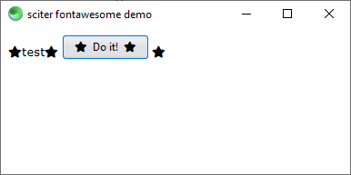

# sciter fontawesome

Fontawesome support for [sciter.js](https://sciter.com/).



## demo

- git clone the repository
- run `install.bat` on Windows or `install.sh` on Mac to download the latest sciter binaries and library
- run `scapp.bat` / `scapp.sh`

## install

- add the `src` dir to your project
- then in your code include `<style src="src/fontawesome.css" />`

## how to convert fontawesome css to work with sciter

Download in respective directories `css` and `fonts`:

    https://cdnjs.cloudflare.com/ajax/libs/font-awesome/5.15.3/css/all.css
    https://cdnjs.cloudflare.com/ajax/libs/font-awesome/5.15.3/webfonts/fa-brands-400.ttf
    https://cdnjs.cloudflare.com/ajax/libs/font-awesome/5.15.3/webfonts/fa-regular-400.ttf
    https://cdnjs.cloudflare.com/ajax/libs/font-awesome/5.15.3/webfonts/fa-solid-900.ttf

In `all.css`

- remove unrecognized `@-webkit-keyframes` properties
- replace all `:before` by `::before`
- remove all `src` from `@font-face` except the ttf ones
- remove `format("truetype")` from `@font-face`
- add to the end of file

```css
// reset ux-master.css default vertical flow
button {
  flow: horizontal;
}

// reset master-base.css properties on first and last child
button > :first-child {
  margin-top: 0;
}

button > :last-child {
  margin-bottom: 0;
}

// fix icons vertical alignment in button
button > i {
  vertical-align: middle;
}

// improve icon position in button
button > i:first-child {
  margin-right: 0.5em;
}

button > i:last-child {
  margin-left: 0.5em;
}
```
